## 1.1 命题

### 1) 命题定义

命题是能判断真假（对错）的陈述句，也称为具有唯一真值的陈述句

> 判断给定语句是否命题：
>
> 1. 是否为陈述句
>
> 2. 是否能判断其有唯一的真值

>命题能判断真假，但有可能是undefined的，也就是现在还不知道命题的真假，但是其一定是非真即假。

### 2) 命题符号化

 在数理逻辑中，将命题和它的真值用抽象的符号表示，称为**命题符号化**。

> 在本书中，用小写的英文字母$p,q,r,⋯,p_i,q_i,r_i,⋯$表示命题变元(变项)；命题的真值用数字1表示真，数字0表示假。

例如：雪是黑色的。   可以符号化为  p: 雪是黑色的。

### 3) 复合命题

> 简单命题：不能包含更小的命题的命题。（原子性）

**复合命题**：由简单命题通过关联词的联结而构成的称述句。

> 复合命题中的关联词称为联结词 

### 4) 联结词

**命题联结词**是用于将多个命题结合成更复杂命题的符号。它们是逻辑表达式的基本组成部分，使得逻辑推理和分析变得更加系统和精确。以下是常见的命题联结词及其符号和含义：

- 否定：$\lnot$
- 合取：$\land$
- 析取：$\lor$
- 蕴含：$\to$
- 等价（双蕴含）：$\lrarr$

#### （1）否定联结词

否定联结词的主要作用是将一个命题的真假值进行翻转，也就是说，如果一个命题为真，否定它后则为假；如果一个命题为假，否定它后则为真。否定联结词的符号通常用$¬$ 表示

|  P   |  ¬P  |
| :--: | :--: |
|  1   |  0   |
|  0   |  1   |

上面的真值表展示了一个命题 $P$与其否定$\lnot P$之间的关系。

> 需要注意的是：所有人都答对了的否定命题是，有人没有答对。 

#### （2）合取联结词

合取联结词（Conjunction） 用于表示两个命题都为真时整个表达式才为真。合取联结词用符号∧表示。

| p | q | p ∧ q |
|---|---|-------|
| 1 | 1 |   1   |
| 1 | 0 |   0   |
| 0 | 1 |   0   |
| 0 | 0 |   0   |

#### （3）析取联结词

析取联结词（Disjunction） 用于表示两个命题中至少有一个为真时，整个表达式为真。析取联结词用符号 ∨表示。

| p | q | p ∨ q |
|---|---|-------|
| 1 | 1 |   1   |
| 1 | 0 |   1   |
| 0 | 1 |   1   |
| 0 | 0 |   0   |

#### （4）蕴含联结词

蕴含联结词（Implication）用于表示一个命题（前提）蕴含另一个命题（结论），它通常用符号 →表示。

> 可以用数学中的充分条件来理解。

| p | q | p → q |
|---|---|-------|
| 1 | 1 |   1   |
| 1 | 0 |   0   |
| 0 | 1 |   1   |
| 0 | 0 |   1   |

> 只有在前提为真，结论为假时，整个命题才为假。

#### （5）等价联结词

**等价联结词**（Biconditional）用于表示两个命题之间的双向蕴含关系，即两个命题在逻辑上是等价的。等价联结词用符号 p↔q表示，它的含义是当且仅当p和q的真值相同（即都为真或都为假）时， p↔q 才为真。

| p | q | p ↔ q |
|---|---|-------|
| 1 | 1 |   1   |
| 1 | 0 |   0   |
| 0 | 1 |   0   |
| 0 | 0 |   1   |

#### （6）联结词优先级

**联结词的优先级**决定了在没有括号的情况下，逻辑运算的顺序。理解联结词的优先级对于正确解析和构造逻辑表达式非常重要。下面是常见逻辑联结词的优先级从高到低的顺序：

1. **否定联结词（Negation）** ¬
2. **合取联结词（Conjunction）** ∧
3. **析取联结词（Disjunction）** ∨
4. **蕴含联结词（Implication）** →
5. **等价联结词（Biconditional）** ↔

### 5) 命题公式及其递归定义

我们先回忆一下初中学的一元二次方程的应用。

例：**一个矩形的长比宽多5米，如果矩形的面积是50平方米，求矩形的长和宽。**

（1）列方程（设变量，找等价关系）

 		设矩形的宽为$x$米，那么矩形的长就是$ x+5$米。 	

​		 根据矩形面积公式，我们可以得到方程：$x \times (x+5)=50$.   

​		 展开方程并整理，得到一个二次方程：$x^2+5x=50$

（2）利用因式分解等技巧解方程
$$
\begin{align}
&x^2+5x-50=0
\\& (x+10)(x-5)=0
\\& x=-10,或\ x=5
\end{align}
$$
数学家们不满足用因式技巧等技巧来找到某一个方程的解，而是寻求可以用在所有方程上的普适性的方法。对于一元二次方程来说，就是求根公式。

一元二次方程的形式：$ax^2+bx+c=0$，求根公式：
$$
x=\frac{-b\pm\sqrt{b^2-4ac}}{2a}
$$
于是，我们只需列出方程，不需要搜肠刮肚地找其中的规律，只需要套公式就可以了。如上面的例题：
$$
\begin{align}
&x^2+5x-50=0
\\& x= \frac{-5\pm\sqrt{25-4\times(-50)}}{2}
\\& x= \frac{-5\pm15}{2}
\\& x_1=5,x_2=-10
\end{align}
$$
命题符号化的过程就类似列方程的过程。今天我们要做的是找到普遍的通用的解决问题的算法

**命题公式**是使用命题变量（如 p、q、r 等）和逻辑联结词（如 ¬、∧、∨、→、↔）构造出来的表达式，用来表示命题之间的逻辑关系。


命题公式的递归定义是指通过逐步应用基本构造规则来定义所有可能的命题公式。递归定义提供了一种系统的方法，用于描述可以构造出的所有合法命题公式。

命题公式可以通过以下递归方式定义：

1. **基础部分**（Base Case）:

- 任意命题变量 p、q、r、... 是命题公式。

2. **递归部分**（Recursive Case）:
   - 如果 p是一个命题公式，那么 ¬p 也是一个命题公式。（使用了否定联结词）

   - 如果 p和 q是命题公式，那么以下都是命题公式：
      - - p∧q（使用了合取联结词 ∧）
        - p∨q（使用了析取联结词 ∨）
        - p→q （使用了蕴含联结词→）
        - p↔q（使用了等价联结词 ↔）


3. **终止条件**:

 - 只有通过上述规则构造出来的表达式才是合法的命题公式，其他任何不符合这些规则的表达式都不是命题公式。

 > 命题公式必须要么是一个命题变量（如 p、q、r 等），要么是通过逻辑联结词将一个或多个命题公式组合在一起。

```
例：p∨r→q 是命题公式吗。

根据命题公式的递归定义：
1.基础部分:
	p、r、q都是命题变量，因此它们都是命题公式。
2.递归部分:
	p∨r是通过析取联结词 ∨组合命题公式p和r得到的，因此p∨r也是一个命题公式,可以设为p
	p∨r→q是通过蕴含联结词→命题公式p和q组合而成的，因此p∨r→q是一个合法的命题公式。
所以，p∨r→q 是一个合法的命题公式。

例：p∧q↔ 是命题公式吗。
1.基础部分:
	p和q是命题变量，属于合法的命题公式。
2.递归部分：
	p∧q是通过合取联结词∧将两个命题公式 p和 q组合而成的，因此 p∧q一个命题公式。
2.问题所在:
	↔ 是等价联结词，用来表示两个命题之间的逻辑等价。根据命题公式的递归定义，等价联结词需要连接两个完整的命题公式，形式为 p↔q其中p和q都是命题公式。
因为在p∧q↔p中，等价联结词 ↔右侧缺少一个完整的命题公式，因此该表达式是不完整的。
```

扩展：递归函数实现斐波那契数列

```c
#include <stdio.h>

// 递归函数来计算斐波那契数列的第n项
long long fibonacci(int n) {
  	//基础部分与终止条件
    if (n <= 0) {
        return 0;
    } else if (n == 1) {
        return 1;
    } else {
      //递归部分
        return fibonacci(n - 1) + fibonacci(n - 2);
    }
}

int main() {
    int n;
    printf("Enter the Fibonacci sequence number to calculate: ");
    scanf("%d", &n);

    // 调用斐波那契数函数并打印结果
    printf("Fibonacci number at position %d is: %lld\n", n, fibonacci(n));
    return 0;
}
```

### 6) 真值表

> 命题公式中变量的值只有真，假两种，因此命题公式中变量进行赋值后的结果也是有限的。我们可以首选列出命题公式的所有结果，看一下该公式有什么特点。

在命题公式中，对于分量指派真值的各种可能组合，就确定了这个命题公式的各种真值情况，把它汇列成表，就是命题公式的真值表。

构造真值表的具体步骤如下：

1. 找出公式中所含的全部命题变元$p_1,p_2,⋯,p_n$。

2. 列出公式中的$2^n$个解释进行赋值。

   > 因为每个变量取值是0或1，所以n个变量所有可能的取值的个数就是n个2相乘，即$2^n$ 

3. 根据赋值依次计算各层次的真值并最终计算出公式的真值

## 1.2. 命题公式等值演算

### 1) 命题公式的类型

> 对真值表的结果进行分类。

命题公式根据其逻辑结构和性质，可以分为以下几种类型

- 永真式 (Tautology)：在所有可能的真值组合下，命题公式的结果都为真。

  | $p$  | $\neg p$ | $p \lor \neg p$ |
  | ---- | -------- | --------------- |
  | 0    | 1        | 1               |
  | 1    | 0        | 1               |

- 矛盾式(Contradiction)：也叫重言式，在所有可能的真值组合下，命题公式的结果都为假。

  | $p$  | $\neg p$ | $p \land \neg p$ |
  | ---- | -------- | ---------------- |
  | 0    | 1        | 0                |
  | 1    | 0        | 0                |

- 可满足式((Satisfiable Formula)：至少在某一真值组合下，命题公式的结果为真。

  | $p$  | $q$  | $p \land q$ |
  | ---- | ---- | ----------- |
  | 0    | 0    | 0           |
  | 0    | 1    | 0           |
  | 1    | 0    | 0           |
  | 1    | 1    | 1           |

  > 永真式是特殊的可满足式。

### 2) 等值式

等值式（Equivalences）是指两个命题公式A，B在所有情况下都具有相同的真值。记为A⟺B

> 等值式表明这两个公式可以互换，具有相同的逻辑意义。

### 3) 等值演算

等值演算（Equational Logic）是一种**基于等值式的推理方法**，通过不断对**局部进行等值替换**的操作，将复杂的表达式逐步简化或转换成另一种等价形式。

24个常用的等值式：

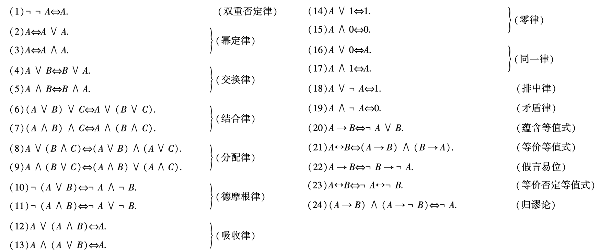

等值演算可以证明两个命题公式是否等值，还可以用来判断命题公式的类型。

等值演算的常用解题思路：

1. 有蕴含联结词，优先使用蕴含等值式
2. 考虑使用结合律、分配律
3. 有否定联结词在括号外面，考虑使用德摩根律
4. 考虑使用幂等律、吸收律、零律、同一律、排中律、矛盾律

## 1.3. 范式

> In logic and computer science, a normal form is a standardized or canonical way of expressing a formula or expression. Normal forms simplify the process of analyzing, comparing, and transforming logical expressions by ensuring that they follow a specific structure.

### **1) 析取范式与合取范式**

- **文字**：命题变项（或称变元）及其否定称为文字（literal）。

  > 在逻辑学中，文字是命题公式的最基本组成部分。一个命题变项可以是一个简单的命题 𝑝，而它的否定¬𝑝也是一个文字

  例：如果𝑝是一个命题变项，那么𝑝和 ¬𝑝都是文字。

- **简单析取式**:逻辑表达式中的一种特殊形式，它由有限多个文字通过析取联结词(∨)联结而成

  > 简单析取式在逻辑表达式的标准化过程中非常重要，特别是在转换为析取范式 (Disjunctive Normal Form, DNF) 时经常用到。

  简单析取式的性质：一个简单析取式$A_i$是重言式⟺含有某个命题变元及其否定式

  > 也就是说，如果一个简单析取式可以被简化为总是为真的公式，则它是重言式。例如：p∨¬p∨r∨s

- **简单合取式**:逻辑表达式中的一种特殊形式，它由有限多个文字通过合取联结词(∧)联结而成

  一个简单合取式$A_i$是矛盾式⟺含有某个命题变元及其否定式

  > 也就是说，如果一个简单合取式可以被简化为总是为假的公式，则它是矛盾式。

- **析取范式**：逻辑公式的一种标准化形式，它由有限个简单合取式的析取构成。

  **形式**类似于：

  $(p_1∧q_1)∨(p_2∧q_2)∨⋯∨(p_n∧q_n)$ 

  例如：$(p∧q)∨(￢p∧r)$

  **析取范式的性质**：一个析取范式A是矛盾式⇔每个简单合取式是矛盾式。例如：$(p∧￢p )∨(￢r∧r)$

- **合取范式**：逻辑公式的一种标准化形式，它由有限个简单析取式的合取构成。

  形式类似于：

  $(p_1∨q_1) ∧(p_2∨q_2)∧⋯∧(p_n∨q_n)$

  **合取范式的性质**：一个合取范式A是重言式⇔每个简单析取式是重言式。例如：$(p∨￢p ) ∧(￢r∨r)$

- 求给定公式范式的步骤

  ① 消去联结词→, ⟷ 

   	  	→ ：蕴含等值式
   	
   		 ⟷ ：等价等值式；(A∧B) ∨ (¬A ∧¬B )

  ② 否定号的消去或内移

   		消去：双重否定律
   	
   		内移：德摩根律

  ③适当使用分配律

  ​		 析取范式： **∧**对∨的分配律

  ​		 合取范式： ∨对**∧**的分配律

​		**练习**：求公式((p∨q)→r)→p的析取范式与合取范式

​		析取范式：
$$
\begin{align}
&\ \ \ \  \ \  \ \ \ \ \ \ ((p∨q)→r)→p\\
&\iff\lnot ((p∨q)→r) \lor p\\
&\iff\lnot (\lnot (p∨q)\lor r) \lor p\\
&\iff ( (p∨q)\land \lnot r) \lor p\\
&\iff ( (p\land \lnot r)\lor (q\land \lnot r)) \lor p\\
&\iff  (p\land \lnot r)\lor (q\land \lnot r) \lor p\\
\end{align}
$$
​		合取范式：
$$
\begin{align}
&\ \ \ \  \ \  \ \ \ \ \ \ ((p∨q)→r)→p\\
&\iff\lnot ((p∨q)→r) \lor p\\
&\iff\lnot (\lnot (p∨q)\lor r) \lor p\\
&\iff ( (p∨q)\land \lnot r) \lor p\\
&\iff ( (p∨q)\lor p) \ \land (p\lor \lnot r) \\
&\iff ( p∨q) \ \land (p\lor \lnot r) \\
\end{align}
$$

### 2) 主析取范式与主合取范式

析取范式与合取范式是不唯一的。

例如: (p∨q)∧(￢p∨￢q) 。其中 (p∨q)能写成 (p∨0∨q), (pvqvq)……

我们想要的是：**范式是唯一的**。

每个真值函数（真值表的最后一列）可以对应多种命题公式，为了避免形式多样带来的不便，指定其中的一种形式作为标准，这就是主析取范式和主合取范式。

- 极小项：在含有n个命题变元的简单合取式中，若每个命题变元或其否定仅**出现一次**，且各变元按其字母顺序出现，称这样的简单合取式为极小项。
- 极大项：在含有n个命题变元的简单析取式中，若每个命题变元或其否定仅**出现一次**，且各变元按其字母顺序出现，称这样的简单析取式为**极大项**。


- **主析取范式**：一个析取范式中，如果所有简单合取式均为极小项，则称该析取范式为主析取范式(Principal Disjunctive Normal Form, PDNF)。

  > “Principal”强调了这种范式在逻辑表达式中的标准化和规范化的重要性。主析取范式表示的是逻辑函数的一种主要或标准的表达方式，确保逻辑表达式结构清晰、唯一，且便于分析和比较。

- **主合取范式**：一个合取范式中，如果所有简单析取式均为极大项，则称该合取范式为主合取范式（Principal Conjunctive Normal Form, PCNF

练习：求公式((p∨q)→r)→p的主析取范式与主合取范式

​		主析取范式：
$$
\begin{align}
&\ \ \ \  \ \  \ \ \ \ \ \ ((p∨q)→r)→p  \\ 
&\iff  (p\land \lnot r)\lor (q\land \lnot r) \lor p\qquad (先转换为析取范式)\\
&\iff(p\land \lnot r \land (q\lor\lnot q))\lor (q\land \lnot r\land(p\lor \lnot p))\lor(p\land(q\lor\lnot q)\land(r\lor\lnot r))\qquad (每个简单合取式通过排中律引入缺失的命题变项)\\
&\iff(p\land ((\lnot r\land q)\lor(\lnot r\land\lnot q)))\lor (q\land((\lnot r\land p)\lor(\lnot r\land\lnot p)))\lor\bigg( 
\Big ((p\land q\big )\lor\big(p\land\lnot q )\Big)\land (r\lor\lnot r)
\bigg)\qquad (分配律)\\
&\iff \bigg( (p\land q\land \lnot r)\lor(p\land\lnot q\land\lnot r)\bigg)\lor \bigg((p\land q\land \lnot r)\lor (\lnot p\and q\land \lnot r )	\bigg)\lor \bigg( \Big( ((p\land q)\land (r\lor \lnot r))\lor ((p\land\lnot q)\land(r\lor \lnot r))\Big)  \bigg)\qquad (分配律)\\
&\iff  \bigg( (p\land q\land \lnot r)\lor(p\land\lnot q\land\lnot r)\bigg)\lor \bigg((p\land q\land \lnot r)\lor (\lnot p\and q\land \lnot r )	\bigg)\lor \bigg(\Big( (p\land q\land r)\lor(p\land q\land \lnot r)	\Big)\lor \Big( (p\land \lnot q\land r)\lor(p\land \lnot q\land\lnot r) \Big)\bigg)\qquad (分配律)\\
&\iff (p\land q\land \lnot r)\lor(p\land\lnot q\land \lnot r)\lor(\lnot p\land q\land \lnot r)\lor(p\land q\land r)\lor (p\land\lnot q\land r)
\end{align}
$$

### 3) 真值表与主析取(合取)范式

- 极小项的性质

  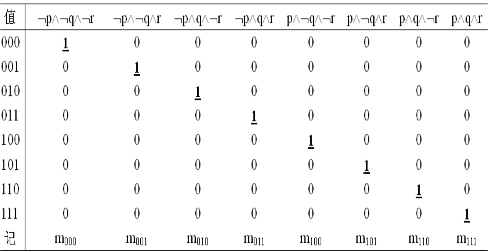

  ​	①每一行只有一个小项的值为1

  ​	②每一列，每个小项仅在一个指派中为1

  ​	③取赋值为1的对应的十进制为极小项的角码

  > 将其中仅有的，可以使极小项值为1的赋值作为角码

- 极大项的性质

  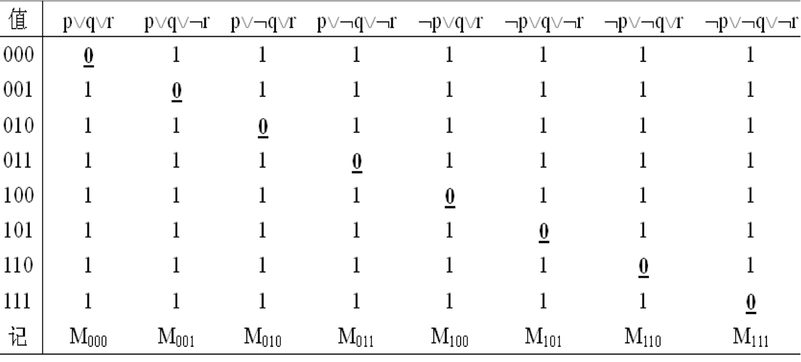

  ​	①每一行只有一个小项的值为0

  ​	②每一列，每个小项仅在一个指派中为0

  ​	③取赋值为0的对应的十进制为极小项的角码

  > 将其中仅有的，可以使极大项值为0的赋值作为角码

例：利用真值表求公式(p→q)⟷r的主析取范式与主合取范式

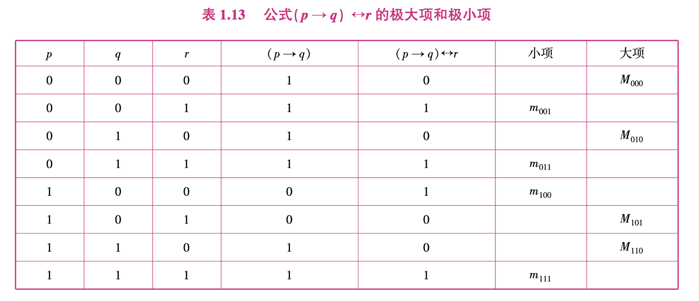

主析取范式：

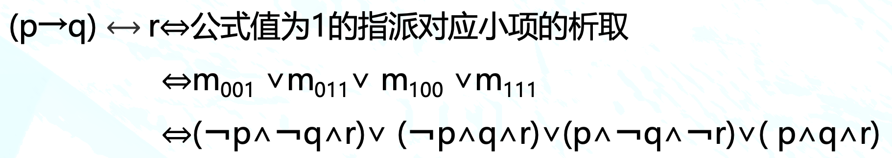

主合取范式：

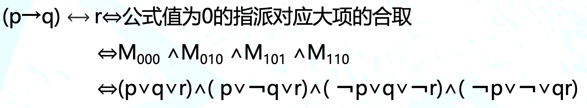

## 1.4. 命题逻辑推理理论

### 推理概述

#### **推理的定义**

从已知条件、假设、前提或公理出发，根据推理规则推出结论、定理的过程，称为**推理**。

> 推理是对数学证明以及各种各样领域中的推理思想的高度抽象。

#### **推理的两种形式系统**

​		**自然推理系统**：

​		自然推理不预设公理，只是根据规则，从给定的前提命题出发得出结论命题。这似乎更符合人们日常思维的习惯，因此，称之为自然推理。

​		**公理系统**：

​		从若干给定的公理(真实且不可证明的命题)出发，应用推理规则进行推理演算。公理系统的主旨是将推理规则和公理相结合,通过公理推导出结论。

#### 有效推理

设$A_1,A_2,⋯,A_k,B$ 都是命题公式，若对于$A_1,A_2,⋯,A_k,B$ 中出现的命题变项的任意一组赋值，或者$A_1∧A_2∧…∧A_k$为假，或者当$A_1∧A_2∧…∧A_k$为真时，$B$也为真，则称由前提$A_1,A_2,⋯,A_k$推出$B$的**推理是有效**的或正确的，并称B是有效的结论。

由前面的定义容易证明下面定理：设A与B是两个命题公式，若$A→B$为重言式，则称$B$是$A$的有效结论，或称$A$可以逻辑推出$B$，记为$A\implies B$。

#### **推理的有效性和结论的真实性**

必须把推理的有效性和结论的真实性区别开

(1)有效的推理不一定产生真实的结论

有效推理中：前提是假时，不论结论是否真实都是有效的推 理。

例如：

 	前提 1：如果月亮是由奶酪做的，那么奶牛可以飞行。
 	
 	前提 2：月亮是由奶酪做的。

​	 结论：奶牛可以飞行。

(2) 产生真实结论的推理未必是有效的

例如：

​	 前提 1：如果太阳从东方升起，那么奶牛是牛。

​	 前提 2：奶牛是牛。

​	 结论：太阳从东方升起。

>  这是逆命题错误

推理的有效性仅指推理过程的**逻辑形式正确**，而结论的真实性还取决于前提的真实性。

### 推理的形式结构

推理的形式结构：$（A_1 ∧ A_2 ∧ … ∧ A_k）\implies B$

还有另外的表达方式，比如将前提与结论分开写：

 前提：$A_1，A_2，…，A_k$.

 结论：$B$. 

### 自然推理系统

#### 推理规则

推理规则是逻辑学中从前提推导出结论的合法模式。通过这些规则，可以在**给定一组前提**的情况下，**正确地推导出有效的结论**。

> 推理规则广泛用于数学证明、计算机科学以及哲学推理中。

常见的推理规则如下：

- 假言推理：A∧(A→B)⟹B

  我们用前3节的知识来证明。首先用真值表：

  | A    | B    | A → B | (A → B) ∧ A | (A → B) ∧ A → B |
  | ---- | ---- | ----- | ----------- | --------------- |
  | 0    | 0    | 1     | 0           | 1               |
  | 0    | 1    | 1     | 0           | 1               |
  | 1    | 0    | 0     | 0           | 1               |
  | 1    | 1    | 1     | 1           | 1               |

  再用等值演算：

  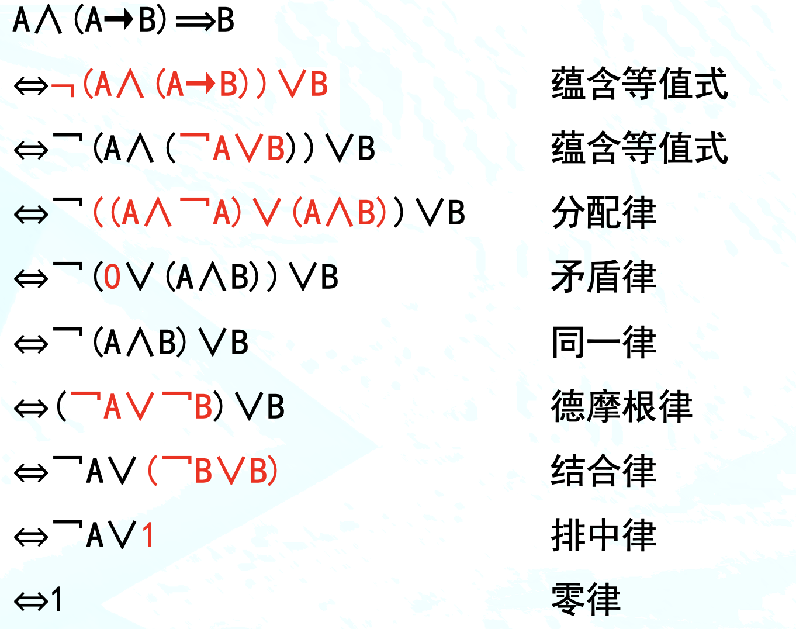 

  例：

   前提1： 如果今天下雨，那么我会带伞

   前提2： 今天下雨了

   结论： 我带伞了
  $$
  \begin{aligned}
  &设\ 	p:今天下雨，q:我会带伞
  \\& 根据题意得到形式结构：（p\to q）\land p \implies q
  \end{aligned}
  $$

- 假言三段论：$(A→B)∧(B→C)⟹(A→C)$

  例：

  前提1：如果下雨，那么地面会湿。

  前提2：如果地面湿了，那么路滑。

  结论：如果下雨，那么路滑。

- 拒取式：$(A→B)∧￢B⟹￢A$

  例：

  前提1：如果今天是周末，那么我会去公园。

  前提2：我没有去公园。

  结论： 今天不是周末。

- 析取三段论：(A∨B)∧**￢**B⟹A

  > 通过排除某种条件，可以确定剩余条件的真实性

​	例：假设我们有一个程序，它检测文件是否满足某些条件，然后做出相应的处理。

​		前提1： 文件要么是文本文件，要么是图片文件。

​		前提2： 该文件不是文本文件。

​		结论： 因此，文件是图片文件。

- 化简律：$(A∧B)⇒A$

  > 这个推理规则在逻辑证明中非常有用，因为它允许我们从复合命题中**提取出单个命题**来进行进一步的推理。

  例：

  ​	前提1：文件被成功打开，并且内容已被加载。

  ​	结论： 文件被成功打开。

- 附加律：A(A∨B)

- 构造性二难：$(A→B)∧(C→D)∧(A∨C)⟹ B∨D$

  > “二难”（Dilemma）这个术语来源于拉丁语单词 “dilemma”，意为“双重前提”。"二难"推理特指一种包含两个前提的论证，每个前提都指向一个不同的结论，而论证者必须在这两个结论之间做出选择。

  例：

  前提1： 如果今天下雨，我会待在家里

  前提2： 如果明天下雨，我会取消计划

  前提3： 今天下雨或者明天下雨

  结论： 我会待在家里或者取消计划

  

  构造性二难特殊形式：$(A→B)∧(￢A→B)⇒B$

  **例：**

  前提 1：如果程序检测到文件已加载，则系统将执行处理操作。

  前提 2：如果程序没有检测到文件加载，则系统将执行处理操作。

  结论：无论文件是否加载，系统都会执行处理操作。

  > 反映了程序中无论特定条件是否满足，系统都会采取某种行动的逻辑

- 破坏性二难：$(A→B)∧(C→D)∧(￢B∧￢D)⇒(￢A∧￢C) $

  例：

  前提 1：如果用户的密码过期了，那么他无法登录系统。

  前提 2：如果服务器宕机了，那么网站会不可访问。

  前提 3：网站可以访问,用户也能正常登录系统。

  结论：用户的密码没有过期，服务器没有宕机。

#### 推理方法

- 附加前提证明法

  当推论的结论为蕴含式A→𝐵 时，把𝐴加入推理的前提，把B作为推理的结论 

  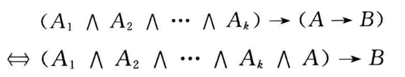

  例：

  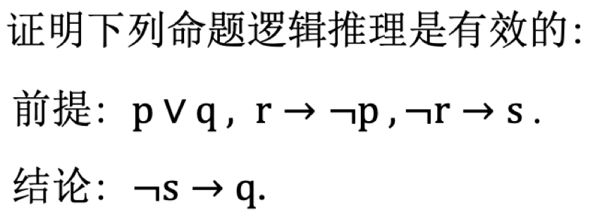

$$
\begin{align}
&①\ \lnot s  \qquad &&附加前提引入
\\&②\ \lnot r\to s\qquad && 前提条件
\\&③\ 	 r	  \qquad && ①、② 拒取式
\\&④\ r\to \lnot p 	 	  \qquad &&前提条件
\\&⑤\ 	\lnot p 	 	  \qquad && ③、④假言推理
\\&⑥\ p\lor q\qquad &&前提条件
\\&⑦\ 	q 	  \qquad && ⑤、⑥析取三段论
\\&⑧\ 结论 \lnot s\to q 得证	&& 由①推到⑦
\end{align}
$$

- 归谬法

  把结论的否定加入前提，然后推出矛盾，即以0为结论

  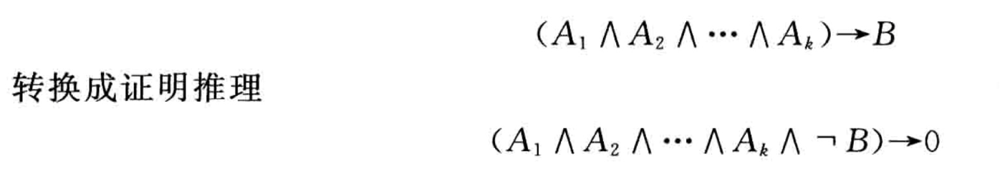

​	
$$
\begin{align}
&①\  p  \qquad && 结论的否定
\\&②\ p\to \lnot q\qquad && 前提条件
\\&③\ 	 \lnot q	  \qquad && ①、②假言推理
\\&④\ \lnot r\or q 	 	  \qquad &&前提条件
\\&⑤\ 	\lnot r 	 	  \qquad && ③、④析取三段论
\\&⑥\ r\land \lnot s\qquad &&前提条件
\\&⑦\ 	r	  \qquad && ⑥减化律
\\&⑧\ 0	  \qquad && ⑤、⑦矛盾律
\\&\ 结论 \lnot p得证
\end{align}
$$


​		例：用归结法证明下面推理 

​		前提:$¬p→q,p→r, r→t$

​		结论:$q∨t$
$$
\begin{align}
&①\  \lnot(q\lor t)  \qquad && 引入结论的否定
\\&②\ \lnot p\to q\qquad && 前提条件
\\&③\ 	 p\lor q	  \qquad && ②蕴含等值式
\\&④\ p\to r 	 	  \qquad &&前提条件
\\&⑤\ 	\lnot p\lor r 	 	  \qquad && ④蕴含等值式
\\&⑥\ q\lor r\qquad && ③、⑤归结规则
\\&⑦\ 	r\to t	  \qquad && 前提条件
\\&⑧\ \lnot r\or t	  \qquad && ⑦蕴含等值式
\\&⑨\ q\or t	  \qquad && ⑥、⑧归结规则
\\&⑩\ 0	  \qquad && ①、⑨矛盾律
\\&\ 结论 q\lor t得证
\end{align}
$$
​	例：证明$√2$是无理数

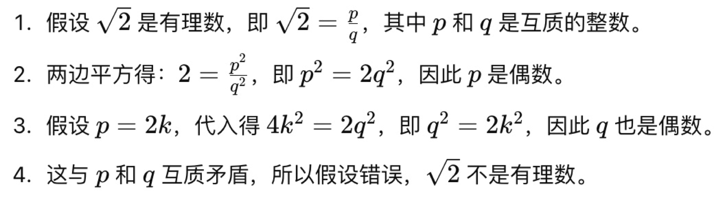

- 归结证明法

  又称为消解法。利用了归结规则

  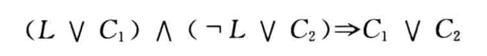

  证明步骤：

  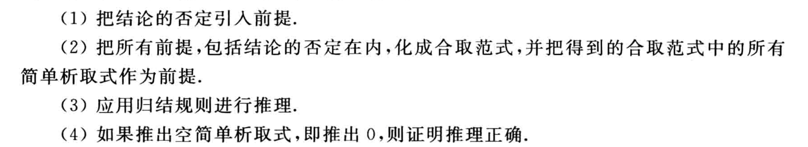

  例：用归结法证明下面推理 

  前提:$¬p→q,p→r, r→t$

  结论:$q∨t$.

  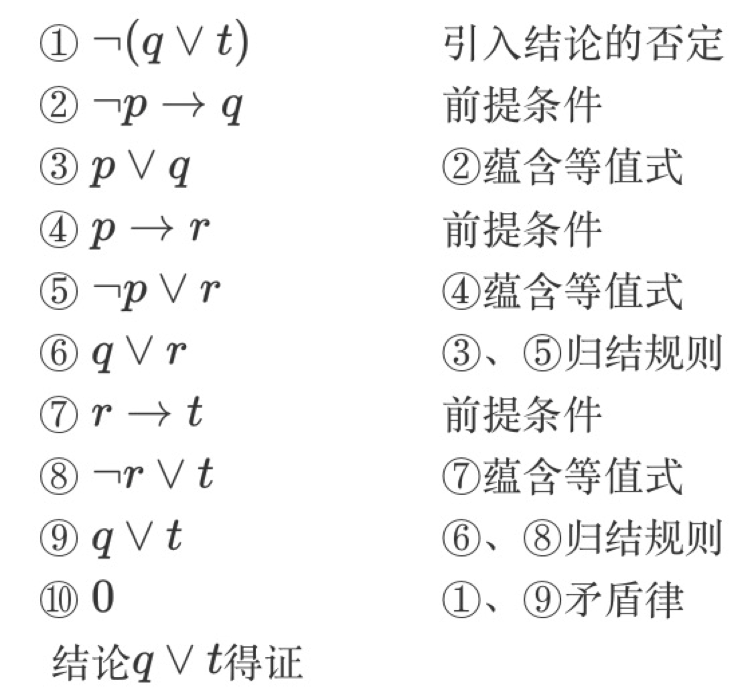
