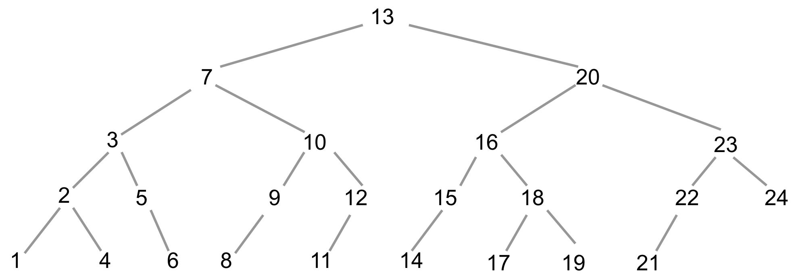

- [x] 离散数学有什么用，为什么要学习离散数学
- [x] 离散数学要学习的内容是什么
- [x] 离散数学的授课方式

## 1.为什么要学习离散数学

离散数学对于计算机专业的学生和从业者来说，具有重要的意义

- 计算机科学的基础

  离散数学为计算机科学提供了理论基础。计算机本质上处理离散数据（如二进制数据、字符、图像像素等），因此离散数学在算法设计、数据结构、数据库理论、加密技术等方面起着关键作用。

  - 假设你是一名物流经理，需要将货物从仓库运送到客户。如何找到从仓库到客户的最短路径。

    城市的道路可以用一张图来表示，其中节点代表地点，边代表道路，每条边都有一个权重，表示道路的长度或运输成本。可以通过**Dijkstra（迪杰斯特拉）算法**来解决

  - 假设你需要设计一个系统来高效地管理和查找学生的学号。给定一批学生的学号，你希望能够快速地找到某个学生是否存在于系统中。如果直接使用无序列表，查找的时间复杂度为 O(n)O(n)O(n)，这是不够高效的。我们可以使用**二叉搜索树（Binary Search Tree, BST）**来提高查找效率。

    > "猜数字"游戏
    >
    > 规则：玩家在1-25之间随机选择一个数字。庄家告知玩家猜测的数字是大了还是小了，玩家根据系统的提示继续猜测，直到猜中目标数字。
    >
    > 问题：玩家猜几次一定可以猜对。
    >
    > 
  
  - 关系数据库中的"关系"指的就是离散数学中的关系代数
  
  - 操作系统、数据库管理系统、服务器软件等，常需要处理任务之间的优先级或依赖关系问题，这些问题可以用有向无环图（DAG）来表示。
  
  - 数论、模运算、逆元运算在加密算法中有广泛应用
  
    - 凯撒密码的加密
  
      1. 将字母表中的每个字母转换为一个整数，通常是从0到25。例如，“A”对应0，“B”对应1，依此类推，“Z”对应25
  
      2. 给定一个明文消息中的字母 xxx，以及一个加密密钥（偏移量） kkk，密文中的字母 yyy 由以下公式给出：
         $$y= (x+k)\mod 26$$
      
	       > 假设要加密字母“B”，并且密钥 $k=3$，则：$y=(1+3)\mod 26=4$。因此，“B”被加密为“E”。
    
	  - 凯撒密码的解密
	  
	    解密时，我们需要将加密的字母向相反的方向移动同样的位数。给定一个密文中的字母 $y$，解密得到的明文字母$x$由以下公式给出：
	    														$$ x=(y-k)\mod 26 $$
	    
	     > 假设要解密字母“E”，并且密钥 $k=3$，则：$x=(4-3)\mod 26=1$。因此，“E”被解密为“B”。
	  
	  > **课后练习：将“Hello”用凯撒密码进行加密。加密秘钥是15**
	

- 提升抽象思维与逻辑思维能力

  - 你是一名侦探，需要通过下面的信息推理出谁是嫌疑人：

    1. 如果小明在派对上，那么小李也在派对上。
    2. 小李不在派对上。
    3. 如果小王不在派对上，那么小明在派对上。

    现在的问题是，**小王在派对上吗？**

    > 抽象的数学思维：首先符号化，然后用逻辑推理来分析。 这个思维与初中数学中设变量后建立方程，然后利用移项、合并同类型来解方程是类似的，也就是先转换为数学问题，让后利用已建立的数学规则来解决问题。

    （1）$p(x)$: x在派对上

    ​		根据条件，有

    ​		①	$ p(小明)\to p(小李)$

    ​		②	$ \lnot p(小李)$

    ​		③	$\lnot p(小王)\to  p(小明)$

    （2）逻辑推理

​					根据①得到逆否命题 ④	$\lnot p(小李)\to \lnot p(小明)$		#等值演算

​					根据①、④ 得到  ⑤	$\lnot p(小明)$		#肯定前件式

​					根据③得到逆否命题⑥	$\lnot p(小明)\to p(小王) $			#等值演算

​					根据 ⑤、⑥得到  $p(小王)$。				#肯定前件式

​					所以，结论就是**小王在派对上**

## 2. 离散数学学什么

- 命题逻辑 (Propositional Logic)
  - 如何用逻辑联结词来组合简单的命题，并利用推理形式判断其真假。
- 谓词逻辑 (Predicate Logic)
  - 研究带有变量的命题及其量化（全称量词和存在量词）的逻辑推理。
-  集合与关系 (Sets and Relations)
  - 集合学的是如何定义和操作一组对象，比如怎么找共同点（交集）或组合在一起（并集）。
  - 关系学的是如何描述和分析两个集合中的元素之间的关联，比如一个集合的元素和另一个集合的元素之间是怎么对应的。
- 函数 (Functions)
  - 函数是一个将每个输入（来自定义域）映射到唯一输出（在值域中的元素）的关系。
- 图论 (Graph Theory)
  - 研究图的结构和性质，涉及顶点和边的关系，以及在此基础上的遍历、最短路径、连通性等问题。
- 树及其应用 (Trees and Applications)
  - 树是一种无环连通图，主要研究其结构、遍历方法及在数据存储和算法中的应用，如哈夫曼算法。
- 代数结构 (Algebraic Structures)
  - 代数结构是对集合论、数理逻辑、线性代数、图论以及拓扑学等数学领域的抽象和扩展。它通过在集合上定义运算和研究这些运算的性质，为这些领域提供了**统一的理论框架**，使得我们能够在更高层次上分析和应用这些概念。

## 3. 离散数学的授课方式

- 讲授理论
  - 讲解离散数学中的核心概念、定理、证明方法以及数学技巧
-  实践与应用
  - 侧重于将理论知识应用于实际问题，培养学生的分析和解决问题的能力

> 我们会讲授核心概念、并阐述定理的证明思路，但是不会大量训练证明技巧。我们将通过案例来理解理论，并培养解决问题的能力。

